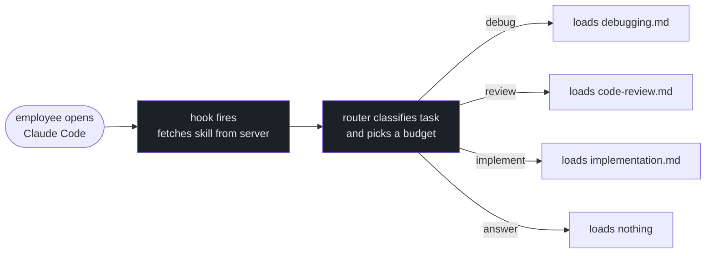

# Tokenwise

An editable workflow framework for AI coding agents. Define your team's engineering process as compact reference cards. Every agent on the team loads only what the current task needs — automatically.

## The Problem

Most agent workflow tools load everything all the time. A debugging skill, a review skill, an implementation skill — all injected at session start whether the task needs them or not. That's ~1,500 words of context on every task, most of it irrelevant.

There's also no consistency. One engineer's agent follows TDD. Another's doesn't. A third has no workflow at all. The same team, three different behaviors.

## How It Works



**For the employee:** they drop one config file in `~/.claude-personal/`. After that, every time they open Claude Code, the team's workflow is loaded automatically. They never think about it again.

**For the admin:** edit reference cards from a dashboard. Every update is live on the next session — no reinstall, no IT ticket, no action from anyone.

## Deployment

```
Admin dashboard  →  edit cards, review agent findings
      ↓
Tokenwise server  →  serves the current skill via API
      ↓
settings.json     →  one file IT drops on employee machines
      ↓
Claude Code       →  loads the skill automatically at session start
```

IT deploys `settings.json` once via MDM (Jamf, Intune, etc) — the same tool companies use to push VPN or antivirus configs. The file tells Claude Code to fetch the team's skill from the company server on startup. From that point on, every agent session uses the current framework. Admin pushes a card update → all employees pick it up next session.

## The Framework

Companies customize the framework to reflect their actual process:

```
framework/
├── config.yaml          ← define your task types and budgets
└── references/
    ├── debugging.md     ← your debug process, your tools, your log locations
    ├── code-review.md   ← your review checklist and standards
    ├── implementation.md ← your coding conventions
    └── onboarding.md    ← how to orient in your codebase
```

Each reference card is 100–200 words. The router loads at most one per task. Generic advice stays off the context window — only the relevant card loads, only when it's needed.

Reference cards ship with solid defaults. They work immediately. Teams improve them over time by merging agent-discovered patterns.

### Build and deploy

```bash
# Build the skill from your config and reference cards
node scripts/build-skill.mjs --config framework/config.yaml

# Watch mode — rebuilds automatically when you edit a card
npm run build:watch
```

### Agent findings

When an agent discovers a useful pattern, it can submit a finding:

```bash
node scripts/contribute-finding.mjs \
  --card debugging \
  --finding "Check git log before any search — regressions are almost always recent" \
  --task "auth token expiry bug"
```

Findings land in `framework/findings/` for admin review. Merge the ones worth keeping — they're added to the relevant card and pushed to all agents on next session.

```bash
npm run findings           # list pending
npm run findings:merge <file>  # merge one into its card
npm run build              # rebuild and push
```

## Admin Dashboard

An admin dashboard for managing findings, editing reference cards, and generating API keys is in development. For now, manage the framework directly via the CLI tools above.

## Install (Claude Code)

```bash
# 1. Copy the skill to your Claude skills directory
cp -r skills/tokenwise ~/.claude/skills/tokenwise

# 2. Or build a custom skill from the framework template
node scripts/build-skill.mjs --config framework/config.yaml
cp -r skills/my-team ~/.claude/skills/my-team
```

For teams, copy `adapters/claude/CLAUDE.md` to the project root and point the hook at your Tokenwise server.

## Other Platforms

| Platform | Install |
|---|---|
| Codex | Copy `adapters/codex/AGENTS.md` into the agent instructions surface |
| Cursor | Copy `adapters/cursor/tokenwise.mdc` into `.cursor/rules/` |
| opencode | Copy `adapters/opencode/AGENTS.md` into the project root |

## Measurement Status

No valid token-savings claim exists yet.

The first pilot (6 Codex runs) used a broken variant — the Tokenwise SKILL.md was not injected, so the tokenwise agent ran with a 6-bullet description instead of the actual router. Those results have been retracted. See [docs/REAL_EVAL_STATUS.md](docs/REAL_EVAL_STATUS.md) for the full post-mortem.

The variant is now fixed. The first valid paired run (Claude Code, orientation task) confirmed the router is active — it classified the task, loaded exactly one reference, and stopped. A broader comparison across task types is pending.

## Local Checks

```bash
npm run check
```

## Current State

- 91 evidence cards across 8 categories
- Runtime skill: under 300 words
- Framework template with 5 default reference cards
- Agent findings workflow (contribute, review, merge)
- Admin dashboard: in development
