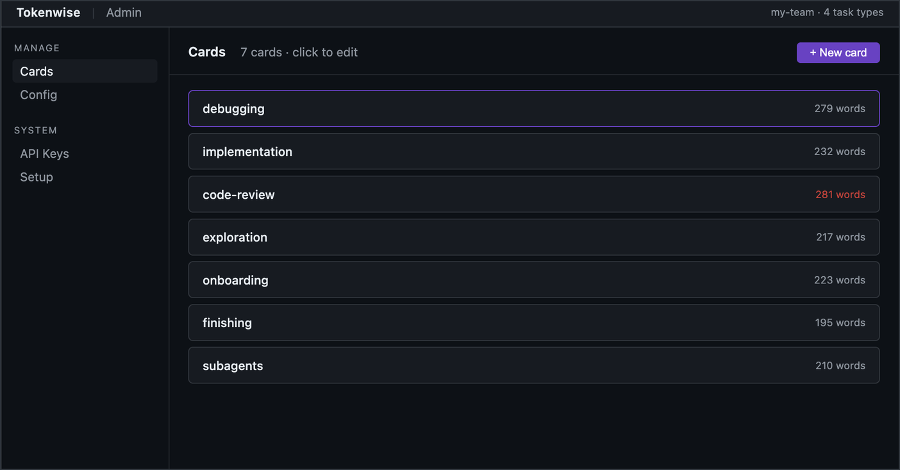
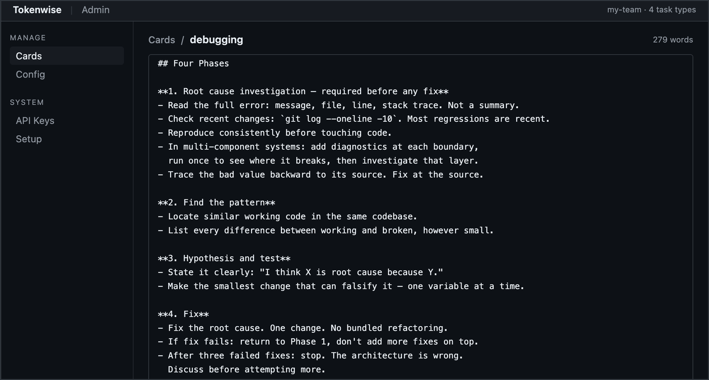

<h1 align="center">Tokenwise</h1>

<p align="center">
  <strong>Ship one AI workflow to your entire engineering team.</strong><br>
  Every agent follows the same process. You control it from a dashboard.
</p>

<p align="center">
  <a href="https://www.npmjs.com/package/@j___avi/tokenwise"></a>
  <a href="LICENSE"></a>
</p>

<br>

<p align="center">
  
</p>

<br>

## The problem

10 engineers using Claude Code means 10 different workflows. One follows TDD. One doesn't. One loads every tool available. One runs completely raw.

And when you want to change something — say, everyone should check `git log` before searching — there's no way to push that out. You'd have to update every person's config manually and hope they actually restart.

Tokenwise fixes both. One server, one dashboard, every agent on the team stays in sync automatically.

## How it works

When an engineer opens Claude Code, a hook fires and fetches the team's workflow from the Tokenwise server. The agent gets a router that classifies the task and loads the right reference card on demand — a debug card for bugs, an implementation card for features, nothing for quick answers.

**For the engineer:** IT drops one config file on their machine. After that, every session loads the workflow automatically. They don't have to do anything.

**For the admin:** edit a card in the dashboard, hit save. Every agent on the team picks it up next session — no reinstall, no IT ticket, no action from anyone.

<p align="center">
  
</p>

## Reference cards

The framework has two layers:

**The router** (always loaded at session start) — classifies the task, picks a budget, and decides which card to fetch. Loads once, stays lightweight.

**Reference cards** (loaded on demand, ~200 words each) — the router fetches them only when relevant. A debug task loads `debugging.md`. A code review loads `code-review.md`. A quick answer loads nothing.

Cards live on your server. You own them. Edit in the dashboard and they're live next session — no files on the engineer's machine, no reinstall.

Seven cards ship with solid defaults out of the box:

| Card | What it covers |
|---|---|
| `debugging` | Root cause first, four-phase process, component boundary diagnostics |
| `implementation` | Minimal green, test-first, YAGNI |
| `code-review` | Evidence-based review, technical reception, when to push back |
| `exploration` | Evidence ladder, stop rules, waste patterns |
| `onboarding` | Orient fast in unfamiliar codebases |
| `finishing` | Branch completion — merge, PR, discard workflow |
| `subagents` | Parallel dispatch, isolated context, integration patterns |

## Get started

```bash
npm install
npm run server
```

Visit `http://localhost:3000` to complete setup — set your admin password, create an API key, and download the hook config for your team.

## Deploy to your team

From the Setup page:

1. Generate an API key
2. Download `settings.json` (drop into `~/.claude-personal/`) or `install.sh` (employee runs it once)
3. IT can push `settings.json` via MDM (Jamf, Intune) to all machines automatically — same mechanism companies use to push antivirus configs

Every engineer's Claude Code session loads the framework from that point. You update a card, they get it next session.

## Platform support

| Platform | Method |
|---|---|
| Claude Code CLI / Desktop / VS Code | Hook injection — updates automatically |
| Codex | Static AGENTS.md — re-download after card updates |
| Cursor | Static .mdc rule — re-download after card updates |
| opencode | Static AGENTS.md — re-download after card updates |

Download static adapter files from the Setup page.

## HTTPS

The API key travels in every agent request header. Without HTTPS it goes in plaintext. Don't run this on a shared network without it.

Any Node.js host works — Fly.io, Railway, Render. For a VM with nginx:

```nginx
server {
    listen 443 ssl;
    server_name your-server.example.com;

    ssl_certificate     /etc/letsencrypt/live/your-server.example.com/fullchain.pem;
    ssl_certificate_key /etc/letsencrypt/live/your-server.example.com/privkey.pem;

    location / {
        proxy_pass http://localhost:3000;
        proxy_set_header Host $host;
        proxy_set_header X-Forwarded-Proto $scheme;
    }
}
```

Get a cert: `certbot --nginx -d your-server.example.com`. The server auto-detects `X-Forwarded-Proto: https` and generates correct curl commands in the injected skill.

## License

MIT
