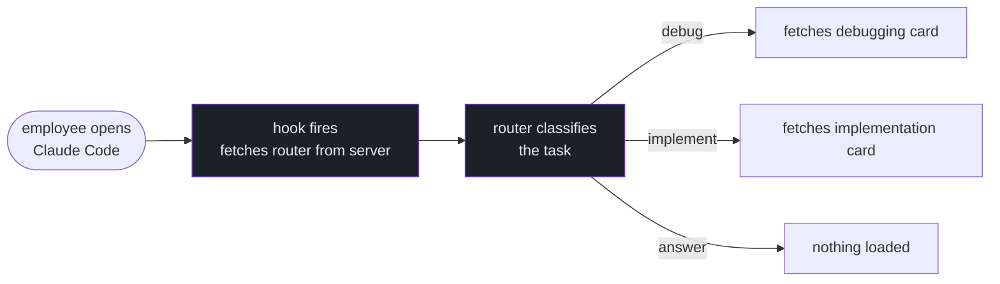

# Tokenwise

A self-hosted server that gives your engineering team a shared AI workflow. Every agent follows the same process. You control it from a dashboard.

## The problem

When you have 10 engineers using Claude Code, you have 10 different workflows. One follows TDD. One doesn't. One loads every tool available. One runs completely raw. No standard.

It's also hard to update. If you want every agent to check git log before searching — good luck propagating that to everyone.

Tokenwise fixes both. One server, one place to manage the workflow, every agent on the team picks it up automatically.

## How it works



**For the engineer:** IT drops one config file on their machine. That's it. Every session after that, their agent loads the team's workflow automatically. They don't know it's happening.

**For the admin:** edit a card in the dashboard, hit save. Every agent on the team picks it up next session. No reinstall. No IT ticket. No action from anyone.

## Reference cards

The framework has two layers:

**The router** (~270 words, always loaded) — injected at session start. Tells Claude to classify the task, pick a budget, and load one reference card if the task needs it.

**Reference cards** (~200 words each, loaded on demand) — the router fetches them from the server only when relevant. A debug task loads `debugging.md`. A code review loads `code-review.md`. A quick answer loads nothing.

Cards live on your server. You edit them in the dashboard. The curl command to fetch each card is baked into the injected router with the team's API key — so no files need to be on the engineer's machine.

## Agent findings

Agents can surface patterns they discover during tasks:

```bash
node scripts/contribute-finding.mjs \
  --card debugging \
  --finding "Check git log before any search — regressions are almost always recent" \
  --task "auth token expiry bug"
```

Findings show up in the dashboard for the admin to review. Merge the useful ones — they get added to the relevant card and served to all agents on next session.

## What ships

```
server/
├── Admin dashboard     ← edit cards, review findings, manage API keys
├── Agent API           ← serves the router + cards to Claude Code on demand
└── Setup flow          ← generates settings.json and install.sh for your team

framework/
└── references/
    ├── debugging.md
    ├── implementation.md
    ├── code-review.md
    ├── exploration.md
    └── onboarding.md
```

Five reference cards ship with solid defaults. They work immediately out of the box. Teams improve them over time.

## Get started

```bash
npm install
npm run server
```

Visit `http://localhost:3000` to complete setup.

## HTTPS

The API key travels in every agent request header. Without HTTPS it goes in plaintext. Don't run this on a shared network without it.

Any Node.js host that terminates TLS for you works — Fly.io, Railway, Render, etc. If you're running on a VM, nginx in front is the usual setup:

```nginx
server {
    listen 443 ssl;
    server_name your-server.example.com;

    ssl_certificate     /etc/letsencrypt/live/your-server.example.com/fullchain.pem;
    ssl_certificate_key /etc/letsencrypt/live/your-server.example.com/privkey.pem;

    location / {
        proxy_pass http://localhost:3000;
        proxy_set_header Host $host;
        proxy_set_header X-Forwarded-Proto $scheme;
    }
}
```

Get a cert with `certbot --nginx -d your-server.example.com`. After that, the server auto-detects `X-Forwarded-Proto: https` and generates correct curl commands in the injected skill.

## Deploy to your team

From the Setup page in the dashboard:

1. Generate an API key
2. Download `settings.json` (drop into `~/.claude-personal/`) or `install.sh` (employee runs it once)
3. IT can push `settings.json` via MDM (Jamf, Intune) to all machines automatically — same way companies push antivirus configs

From that point on every engineer's Claude Code session loads the framework. You update a card, they get it next session.

## Other platforms

Codex, Cursor, and opencode don't support hook injection. From the Setup page you can download a static adapter file (AGENTS.md or .mdc) with the current framework embedded. Re-download when you update cards.

## Token savings

Not the point right now and there's no solid data behind it yet.

The original premise was that loading one ~200-word card beats loading multiple heavy workflow skills every session. That's probably true. But measuring it properly takes more runs across more task types than we've done.

Open to discussing this — if you're running evals on agent workflows and want to compare notes, reach out.

## Local checks

```bash
npm run check
```
