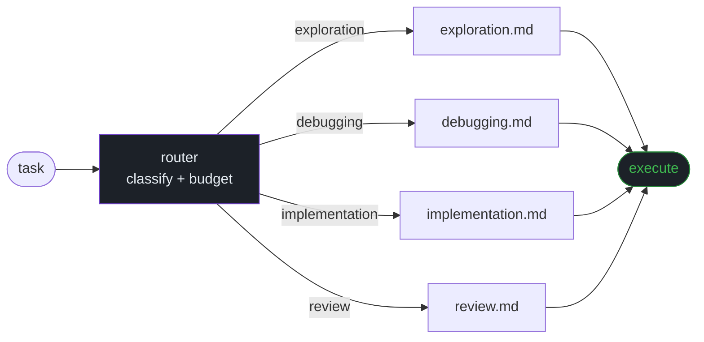

# Tokenwise

Tokenwise is a token-aware workflow layer for coding agents. It integrates
Superpowers-style engineering discipline with CodeGraph-style indexed code
intelligence, then measures whether the workflow actually saves tokens.

The project goal is not "use fewer tokens" as a vague instruction. The goal is a
measured claim:

> Tokenwise + indexed code context should reduce median total tokens versus
> Superpowers-only workflows while preserving task success.

## How it works



The router classifies the task type and budget first, then loads at most one
reference. Superpowers loads its full skill suite on every task; Tokenwise loads
only what the current task requires.

## Architecture

- `skills/tokenwise/` contains the compact runtime skill and on-demand references.
- `knowledge/cards/` stores evidence-backed rules distilled from sources and traces.
- `evals/` defines repeatable tasks, variants, and rubrics.
- `scripts/` measures skill size, validates cards, and summarizes run results.
- `adapters/` provides platform-specific entrypoints for Claude, Codex, Cursor,
  and opencode.

## Measurement First

Tokenwise claims must be earned by evals. Compare these variants:

1. Control: normal agent behavior.
2. Superpowers: current Superpowers workflow.
3. CodeGraph: graph-first navigation only.
4. Tokenwise: workflow router only.
5. Tokenwise + CodeGraph: router plus indexed navigation.

Primary metrics:

- total tokens and cost
- tool calls
- file reads
- grep/search calls
- CodeGraph calls
- skill words loaded
- task success

## Measurement Status

No valid token-savings claim exists yet.

The first pilot (6 Codex runs) used a broken variant — the Tokenwise SKILL.md
was not injected, so the tokenwise agent ran with a 6-bullet description instead
of the actual router. Those results have been retracted. See
[docs/REAL_EVAL_STATUS.md](docs/REAL_EVAL_STATUS.md) for the full post-mortem.

The variant is now fixed. The first valid paired run (Claude Code, orientation
task) confirmed the router is active and behaves correctly — it classified the
task, loaded exactly one reference, and stopped. Token counts were essentially
equal to Superpowers on that task. A broader comparison across task types is
pending.

## Current State

- 91 evidence cards across 8 categories
- Runtime skill body: under 300 words
- Active skill/adapters surface: under 1,700 words
- Variant fix applied: `evals/variants/tokenwise.md` now embeds the full router
- First valid run: router confirmed active, pending broader task coverage

## Local Checks

```bash
npm run check
```

## Eval Smoke Test

```bash
npm run eval:smoke -- --clean
node scripts/summarize-results.mjs results/smoke-runs.jsonl
```

Smoke results are synthetic and prove the pipeline only. Use
`scripts/run-eval.mjs` with a real agent command before making savings claims.

## Install

For Claude Code, copy `skills/tokenwise/` into `.claude/skills/tokenwise/`.

For Codex, copy `adapters/codex/AGENTS.md` into the target agent instructions
surface and keep `skills/tokenwise/` available as a skill folder.

The adapters are intentionally small; the runtime skill loads references only
when the task needs them.
